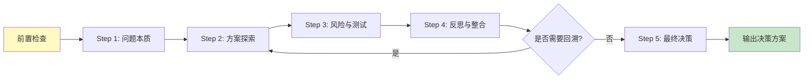

# 路径 D: 特定任务执行

> **触发条件**: 检测到显式指令 (`@think`, `@review`, `@skip` 等)  
> **执行时机**: Step 1 路由决策后  
> **前置步骤**: Step 0 (环境预检) 已完成  
> **更新日期**: 2025-12-19

---

## 📋 任务类型索引

| 指令系列 | 用途 | 复杂度 | 详细说明 |
|---------|------|--------|---------|
| [@think 系列](#think-系列) | 设计思维引导 | ⭐⭐⭐⭐ | 深度设计思考 |
| [@review 系列](#review-系列) | AI 互审 | ⭐⭐⭐ | 方案质量审查 |
| [@skip 系列](#skip-系列) | 跳过某些步骤 | ⭐ | 快速执行 |
| [其他指令](#其他指令) | 特定功能 | ⭐⭐ | 按需扩展 |

---

## @think 系列

### 概述

**目的**: 在生成方案前，引导 AI 进行深度设计思考，避免直接跳入代码实现。

**相关文档**:
- **角色定义**: `agents/runtime/design_facilitator.md`
- **Prompt 模板**: `templates/prompts/design_thinking/step*.md`

### 指令列表

| 指令 | 说明 | 执行流程 |
|------|------|---------|
| `@think` | 标准设计思维引导（完整 5 步） | 5 步完整流程 |
| `@think:standard` | 同 `@think` | 5 步完整流程 |
| `@think:deep` | 深度辩论模式（多轮专家对话） | 扩展流程 + 专家辩论 |
| `@think:quick` | 快速对齐（仅确认目标、方案、验收） | 简化流程（3 步） |
| `@think:skip` | 跳过设计思维引导 | 直接进入 Step 6 |

---

### @think / @think:standard - 标准引导流程

**执行时机**: Step 5（确定子文档清单）之后，Step 6（生成分析方案）之前

**完整流程**:



#### Step 1: 问题本质 (The "Why")

**执行者**: ProductManager  
**目标**: 通过 5 Why 分析挖掘业务价值  
**参考**: `templates/prompts/design_thinking/step1_why.md`

**输出示例**:
```markdown
## Step 1: 问题本质

### 5 Why 分析

**表面需求**: 为项目生成文档体系

**Why 1**: 为什么需要文档？
→ 帮助新成员快速理解项目

**Why 2**: 为什么新成员难以理解项目？
→ 代码缺少注释，架构不清晰

**Why 3**: 为什么架构不清晰？
→ 项目演进过程中缺少设计记录

**Why 4**: 为什么缺少设计记录？
→ 团队没有文档化的习惯

**Why 5**: 为什么没有文档化习惯？
→ 缺少工具和流程支持

### 核心问题

**本质**: 需要建立可持续的文档体系，支持项目演进

**业务价值**:
- 降低新成员上手成本（从 2 周降至 3 天）
- 提升代码可维护性
- 支持知识传承
```

#### Step 2: 方案探索 (The "How")

**执行者**: ArchitectureAnalyst  
**目标**: 提出 2-3 种可行方案并对比  
**参考**: `templates/prompts/design_thinking/step2_how.md`

**输出示例**:
```markdown
## Step 2: 方案探索

### 方案 A: 全量生成

**描述**: 一次性生成所有文档

**优点**:
- 文档完整性高
- 一次性完成

**缺点**:
- 耗时长（预计 8-12 小时）
- 无法中断

**适用场景**: 小型项目（< 50 文件）

### 方案 B: 分批生成（推荐）

**描述**: 按优先级分批生成，支持断点续传

**优点**:
- 可控性强
- 支持中断和恢复
- 用户可以逐步审核

**缺点**:
- 需要多次交互

**适用场景**: 中大型项目（≥ 50 文件）

### 方案 C: 按需生成

**描述**: 只生成用户指定的文档

**优点**:
- 灵活性高
- 节省时间

**缺点**:
- 文档可能不完整
- 需要用户明确需求

**适用场景**: 特定需求场景

### 推荐方案

**选择**: 方案 B（分批生成）

**理由**:
- 平衡了完整性和可控性
- 适用于大多数项目规模
- 支持断点续传，用户体验好
```

#### Step 3: 风险与测试 (The "Risk")

**执行者**: ArchitectureAnalyst & TestEngineer  
**目标**: 识别风险并制定测试策略  
**参考**: `templates/prompts/design_thinking/step3_risk.md`

**输出示例**:
```markdown
## Step 3: 风险与测试

### 风险识别

#### 风险 1: 数据不准确

**描述**: 统计工具失败或数据错误  
**影响**: 高  
**概率**: 中  
**应对**: 使用降级方案（tokei → cloc → find）

#### 风险 2: 会话中断

**描述**: AI 会话可能随时中断  
**影响**: 高  
**概率**: 高  
**应对**: 使用进度记录机制，支持断点续传

#### 风险 3: 文档过时

**描述**: 代码变更后文档未更新  
**影响**: 中  
**概率**: 高  
**应对**: 使用增量更新机制（Commit-Guided）

### 测试策略

#### 测试 1: 数据验证

**目标**: 确保所有统计数据准确  
**方法**: 提供验证命令，用户可自行验证

#### 测试 2: 进度恢复

**目标**: 验证断点续传功能  
**方法**: 模拟会话中断，检查是否能从上次位置继续

#### 测试 3: 增量更新

**目标**: 验证文档能随代码变更更新  
**方法**: 修改代码后，检查相关文档是否更新
```

#### Step 4: 反思与整合 (Synthesis & Reflection)

**执行者**: Facilitator  
**目标**: 全局反思，识别冲突和知识空白  
**参考**: `templates/prompts/design_thinking/step4_reflection.md`

**关键判断**:
- 若发现知识空白或高风险 → 回溯到 Step 2 深化
- 若专家意见冲突 → 呈现冲突，请用户裁决
- 若一切清晰 → 进入 Step 5

**输出示例**:
```markdown
## Step 4: 反思与整合

### 全局反思

**已解决的问题**:
- ✅ 明确了业务价值（降低上手成本）
- ✅ 选择了合适的方案（分批生成）
- ✅ 识别了主要风险并制定应对策略

**知识空白**:
- 🔵 用户对项目规模的预期不明确
- 🔵 用户是否需要 Monorepo 支持

**专家意见冲突**:
无

### 决策

**是否需要回溯**: 否

**理由**: 所有关键问题都已明确，可以进入最终决策

**下一步**: 进入 Step 5（最终决策）
```

#### Step 5: 最终决策 (Final Decision)

**执行者**: Facilitator  
**目标**: 输出结构化决策方案  
**参考**: `templates/prompts/design_thinking/step5_decision.md`

**输出格式**: 应符合 `implementation_plan.md` 标准

**输出示例**:
```markdown
## Step 5: 最终决策

### 背景与目标

**业务价值**: 降低新成员上手成本，从 2 周降至 3 天

**核心问题**: 建立可持续的文档体系，支持项目演进

### 推荐方案

**方案**: 分批生成文档体系

**技术选型**:
- 使用进度记录机制（支持断点续传）
- 使用增量更新机制（Commit-Guided）
- 使用降级策略（确保工具失败时仍能继续）

### 风险与应对

| 风险 | 应对策略 |
|------|---------|
| 数据不准确 | 降级方案 + 验证命令 |
| 会话中断 | 进度记录 + 断点续传 |
| 文档过时 | 增量更新机制 |

### 验收标准

- [ ] 所有文档包含 YAML frontmatter
- [ ] 所有数据都有验证命令
- [ ] 进度记录文件已创建
- [ ] 用户确认文档准确性

### 下一步行动

1. 执行 Step 6（生成分析方案）
2. 基于本决策方案生成 `generation_plan.md`
3. 等待用户审核
4. 执行文档生成
```

---

### @think:deep - 深度辩论模式

**适用场景**: 复杂项目或高风险决策

**与标准流程的区别**:
- 在 Step 2 增加多轮专家辩论
- 引入更多角色（SecurityExpert, PerformanceExpert 等）
- 更深入的风险分析

**执行流程**:
```
Step 1 → Step 2 → 专家辩论（2-3 轮）→ Step 3 → Step 4 → Step 5
```

**专家辩论示例**:
```markdown
## 专家辩论

### 第 1 轮：方案对比

**ArchitectureAnalyst**: 我推荐方案 B（分批生成），因为...

**SecurityExpert**: 我担心方案 B 的安全性，建议...

**PerformanceExpert**: 从性能角度，方案 B 可能...

### 第 2 轮：深入讨论

**ArchitectureAnalyst**: 针对安全性问题，我们可以...

**SecurityExpert**: 这个方案可以接受，但需要...

### 结论

经过辩论，专家们达成共识：
- 选择方案 B
- 增加安全检查步骤
- 优化性能瓶颈
```

---

### @think:quick - 快速对齐

**适用场景**: 简单项目或时间紧迫

**简化流程**（3 步）:
1. 确认目标（What & Why）
2. 确认方案（How）
3. 确认验收标准（Done）

**执行流程**:
```
确认目标 → 确认方案 → 确认验收 → 输出决策
```

**输出示例**:
```markdown
## 快速对齐

### 目标确认

**需求**: 为小型 Vue 3 项目生成文档

**目标**: 帮助新成员快速理解项目结构

### 方案确认

**方案**: 一次性生成 5 个核心文档
- 主文档
- 架构概览
- API 层
- 状态管理
- 部署指南

### 验收确认

**标准**:
- 文档完整
- 数据准确
- 用户满意

### 决策

✅ 方案确认，开始执行
```

---

### @think:skip - 跳过引导

**适用场景**: 
- 用户明确知道需要什么
- 简单任务（如修复拼写错误）
- 时间紧迫

**执行逻辑**:
```
检测到 @think:skip → 跳过 Step 5.5 → 直接进入 Step 6
```

---

## @review 系列

### 概述

**目的**: 在提交给用户审核之前，执行 AI 互审，提高方案质量。

**相关文档**: `workflows/review-workflow.md`

### 指令列表

| 指令 | 说明 | 执行流程 |
|------|------|---------|
| `@review` | 执行 AI 互审（自动评估复杂度） | 0-3 轮审查 |
| `@review:skip` | 跳过 AI 互审 | 直接提交用户审核 |
| `@review:force` | 强制执行 3 轮审查 | 3 轮完整审查 |

---

### @review - 标准互审

**执行时机**: Step 6（生成分析方案）之后，Step 7.5（等待人工审核）之前

**执行逻辑**:

```mermaid
graph TD
    A[生成方案完成] --> B{检测指令}
    B -->|@review:skip| C[跳过互审]
    B -->|@review:force| D[强制 3 轮]
    B -->|@review 或无指令| E[评估复杂度]
    
    E --> F{复杂度评分}
    F -->|< 30 分| G[0 轮审查]
    F -->|30-60 分| H[1 轮审查]
    F -->|60-80 分| I[2 轮审查]
    F -->|> 80 分| J[3 轮审查]
    
    G --> K[提交用户审核]
    H --> K
    I --> K
    J --> K
    C --> K
    D --> J
    
    style K fill:#c8e6c9
```

**复杂度评估标准**:

| 因素 | 权重 | 评分规则 |
|------|------|---------|
| 项目规模 | 30% | < 50 文件: 10 分<br>50-200: 20 分<br>> 200: 30 分 |
| 技术栈复杂度 | 25% | 单一: 5 分<br>多语言: 15 分<br>Monorepo: 25 分 |
| 架构复杂度 | 25% | 简单: 5 分<br>中等: 15 分<br>微服务: 25 分 |
| 特殊场景 | 20% | 无: 0 分<br>1-2 个: 10 分<br>> 2 个: 20 分 |

**审查流程**:

```markdown
## AI 互审流程

### 第 1 轮：基础审查

**审查者**: CodeReviewer

**审查内容**:
- [ ] 数据准确性
- [ ] 代码示例完整性
- [ ] 问题分类合理性

**审查结果**:
- ✅ 数据准确
- ⚠️ 发现 2 处代码示例缺少文件路径
- ✅ 问题分类合理

**改进建议**:
1. 补充代码示例的文件路径
2. 其他无问题

### 第 2 轮：深度审查

**审查者**: ArchitectureAnalyst

**审查内容**:
- [ ] 架构分析准确性
- [ ] 子文档清单合理性
- [ ] 风险识别完整性

**审查结果**:
- ✅ 架构分析准确
- ✅ 子文档清单合理
- ⚠️ 风险识别不完整（缺少性能风险）

**改进建议**:
1. 增加性能风险分析
2. 其他无问题

### 第 3 轮：全局审查

**审查者**: Facilitator

**审查内容**:
- [ ] 方案完整性
- [ ] 逻辑一致性
- [ ] 可执行性

**审查结果**:
- ✅ 方案完整
- ✅ 逻辑一致
- ✅ 可执行

**最终评估**: ✅ 方案质量良好，可以提交用户审核
```

---

### @review:skip - 跳过互审

**适用场景**:
- 简单项目
- 时间紧迫
- 用户信任 AI 生成的方案

**执行逻辑**:
```
检测到 @review:skip → 跳过 Step 7 → 直接进入 Step 7.5
```

---

### @review:force - 强制完整审查

**适用场景**:
- 复杂项目
- 高风险决策
- 用户要求高质量方案

**执行逻辑**:
```
检测到 @review:force → 强制执行 3 轮审查 → 进入 Step 7.5
```

---

## @skip 系列

### 概述

**目的**: 跳过某些步骤，快速执行。

### 指令列表

| 指令 | 说明 | 跳过的步骤 |
|------|------|-----------|
| `@skip:think` | 跳过设计思维引导 | Step 5.5 |
| `@skip:review` | 跳过 AI 互审 | Step 7 |
| `@skip:all` | 跳过所有可选步骤 | Step 5.5 + Step 7 |

**注意**: 跳过步骤可能降低方案质量，仅在必要时使用。

---

## 其他指令

### @commit - 增量更新

**用途**: 触发增量更新流程

**执行逻辑**:
```
检测到 @commit → 路由到路径 C（增量更新）
```

**详细说明**: 参见 [workflows/path_c_incremental_update.md](./path_c_incremental_update.md)

---

### @health - 文档健康检查

**用途**: 触发文档健康度检查

**执行逻辑**:
```
检测到 @health → 路由到路径 B（健康检查）
```

**详细说明**: 参见 [workflows/path_b_health_check.md](./path_b_health_check.md)

---

## 🛠️ 故障处理

**详细说明**: 参见 [workflows/shared/failure_handling.md](./shared/failure_handling.md)

**快速参考**:
- 遇到故障时，优先尝试替代方案
- 记录所有故障到故障追踪表
- 任务结束时汇总提醒用户

---

## ✅ AI 自检项

**详细说明**: 参见 [workflows/shared/ai_checklist.md](./shared/ai_checklist.md)

**快速参考**:
- 生成方案时：数据验证、问题记录、内容质量
- 生成文档时：方案执行、文档结构、摘要与关联、进度记录

---

## 📌 导航

[← 返回主文档](../AI_ENTRY_POINT.md) | [查看其他路径](../AI_ENTRY_POINT.md#路由索引)
