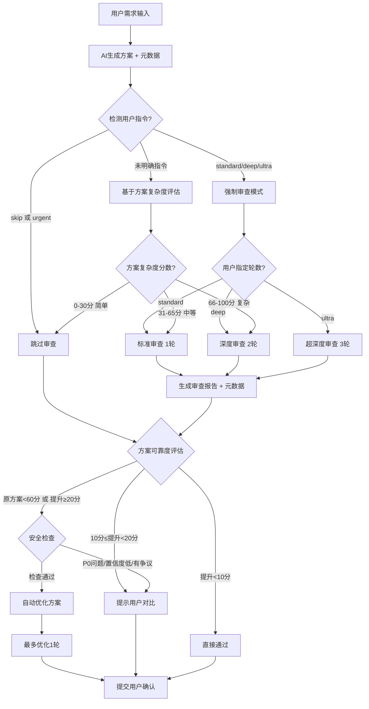

# 013 AI 互审工作流逻辑

**版本**: 1.0
**最后更新**: 2025-12-02

## 1. 工作流决策树

本工作流负责协调 AI 互审流程，决定是否审查以及审查的深度。



## 2. 用户指令识别

AI 在处理请求时，必须优先识别以下指令：

| 指令                  | 含义       | 行为                            |
| :-------------------- | :--------- | :------------------------------ |
| `@review:skip`        | 跳过审查   | 强制进入快速模式，忽略复杂度    |
| `@review:standard`    | 标准审查   | 强制进行 1 轮审查               |
| `@review:deep`        | 深度审查   | 强制进行 2 轮审查               |
| `@review:ultra`       | 超深度审查 | 强制进行 3 轮审查               |
| `@urgent` / `@hotfix` | 紧急模式   | 跳过审查，但标记为 `unreviewed` |

## 3. 复杂度评估逻辑 (混合模式)

当用户未指定指令时，使用以下逻辑评估复杂度：

### 3.1 静态分析 (权重 40%)

| 维度           | 评分规则                                      | 最高分 |
| :------------- | :-------------------------------------------- | :----- |
| **文件数量**   | ≥10 个: 40 分; ≥5 个: 25 分; ≥2 个: 10 分     | 40     |
| **代码行数**   | ≥500 行: 30 分; ≥200 行: 15 分; ≥50 行: 5 分  | 30     |
| **核心模块**   | 触及 `auth/`, `payment/`, `database/`: +20 分 | 20     |
| **破坏性变更** | API 签名变更 / 数据库 Schema 变更: +10 分     | 10     |

### 3.2 AI 语义分析 (权重 60%)

AI 根据以下维度进行 0-100 打分：

- 业务逻辑复杂度
- 语义复杂度
- 潜在风险
- 上下文相关性

### 3.3 综合判定

$$ 最终分数 = 静态分数 \times 0.4 + AI 分数 \times 0.6 $$

- **简单 (0-30)**: 跳过审查
- **中等 (31-65)**: 标准审查 (1 轮)
- **复杂 (66-100)**: 深度审查 (2 轮)

## 4. 可靠度自动判断逻辑

系统根据方案的可靠度自评和审核后的提升潜力，自动决定下一步行动。

### 4.1 判定规则

```python
def should_auto_fix(plan, review):
    # 1. 强制人工介入
    if review.p0_issues > 0: return False, "发现P0严重问题"
    if plan.breaking_change: return False, "破坏性变更"

    # 2. 安全检查
    if review.confidence < 0.6: return False, "审核置信度低"
    if review.controversial: return False, "存在争议"
    if review.new_reliability < plan.reliability: return False, "可靠度反降"

    # 3. 方案已优秀
    if plan.reliability >= 90 and review.improvement < 10: return False, "方案已优秀"

    # 4. 自动优化条件
    if plan.reliability < 60: return True, "原方案不可靠"
    if review.improvement >= 20: return True, "提升显著"

    # 5. 默认
    return False, "提升有限"
```

### 4.2 行为定义

- **自动优化 (Auto Fix)**: AI 生成器根据审核报告自动修改方案（限 1 轮），然后提交用户。
- **提示对比 (Suggest Review)**: 提示用户“审核者建议改进（可提升 XX 分），请评估”。
- **直接通过 (Direct Approve)**: 不打扰用户，直接展示最终方案。
---

## 5. 审查维度扩展 🆕

### 5.1 Commit 质量审查

审查者应检查方案中建议的 commit 策略:

- **WHAT 清晰度**: 是否一句话说清楚做了什么 (满分30)
- **WHY 深度**: 是否说明了业务动机或技术原因 (满分30)
- **HOW 完整性**: 是否说明了实现策略和风险 (满分20)
- **粒度合理性**: commit 大小是否适中 (满分10)
- **可测试性**: 是否说明了如何验证 (满分10)

**评分标准**:
- 分数 < 60: 强制人工介入,要求改进 commit 策略
- 分数 60-80: 给出优化建议但不阻塞
- 分数 > 80: 优质 commit,可直接通过

### 5.2 Git 安全规范审查

审查者应检查方案中的 Git 操作:

**RED ZONE 违规 (零容忍)**:
- ⛔ 在保护分支 (main/master/production) 直接操作
- ⛔ 使用危险命令 (git reset --hard, git push --force)
- ⛔ 执行 merge 操作 (除 git merge --abort)
- ⛔ 强制删除分支或标签

**YELLOW ZONE 检查 (需明确授权)**:
- ⚠️ 创建 feature 分支的命名规范
- ⚠️ commit message 格式
- ⚠️ push 到远程分支的确认

**判定规则**:
- 发现任何 RED ZONE 违规  强制阻塞,要求修改方案
- 发现 YELLOW ZONE 问题  标记警告,建议改进

**参考**: 详见 workflows/git_safety_workflow.md 和 	emplates/AI_RULES_TEMPLATE.md 的 Git 安全规范章节

### 5.3 ADR (架构决策记录) 符合性审查

审查者必须在此环节扮演“架构警察”角色，阻断任何战术式侵蚀：

- **强制要求**: 在代码审查前，先通过 Why-Tool 或人工获取受影响域的当前 Active ADR（`dev_docs/architecture/decisions/*.md`）。
- **审查断言**: 当前的实现、引入的新库、采用的逻辑是否与现存的最新 ADR 产生冲突？
- **判定规则**:
  - ⛔ 发现与现存 Active ADR 具体 `constraints` 断言违背 -> 强制驳回，标记为 P0，并在报告中清晰列明背离点。
  - ⚠️ 隐性绕开 ADR 中指定的解决思路但未直接冲突 -> 提示用户评估并请求补充解释。

---

## 6. 审核对象：单个落盘方案（plan-review）

本工作流默认审核**当前回合刚生成**的 in-flight 产物。还有第三种审核对象——**磁盘上某个具名、独立的落盘方案**（`dev_docs/plans/active/<plan>.md`），它可寻址、可重入、与生成解耦。该对象的语义层（寻址 / 两门禁分离 / 写回 / 想法路由）由 [`core/plan_review_protocol.md`](../core/plan_review_protocol.md) 统一定义，**"怎么审"仍复用本工作流第 3–5 节的引擎**，不另造。

**流程门（进入实现前）**：当用户要对一个已落盘方案发起复查（"审核 plans/active 下某方案、判断是否可进入实现"），或在进入实现前：

1. 以 `<PLAN_PATH>` 寻址该方案。
2. 按复杂度分级（trivial/simple 可 `skipped` 带理由；medium 单轮；complex/critical 双轮）+ 高风险面叠加触发，跑本工作流引擎。
3. 写回方案的"方案自审核记录"块，置 `review_status: reviewed | skipped`。
4. **`reviewed` ≠ 用户已批准实现**——是否动手仍需用户确认（两门禁分离）。

> 该流程门是顾问 / 流程级的（静态检查器拦不住"开始写代码"这一运行时动作）。唯一被 hook 在 commit 时硬强制的是滞后检查点：方案落入 `dev_docs/plans/done/` 却无 `review_status` → `doc_health_checker` 报 blocker（`plan_done_without_review`）。

---

**版本**: 1.2  
**最后更新**: 2026-06-13
