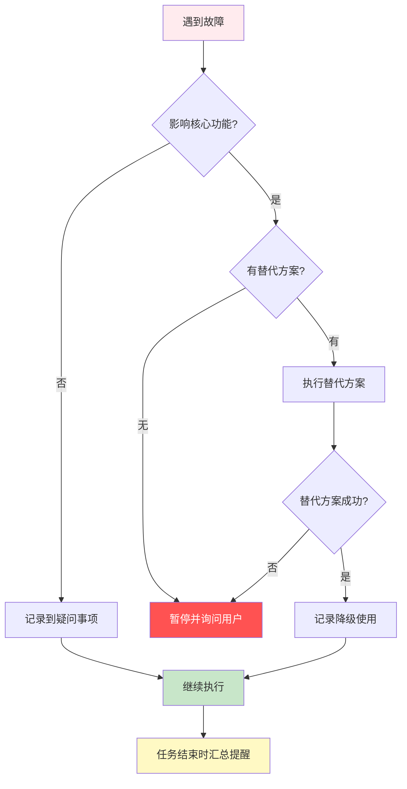

# 故障降级决策机制

> **适用范围**: 所有工作流路径  
> **设计原则**: AI 自主处理故障，能继续则继续，结束时汇总提醒用户  
> **更新日期**: 2025-12-19

---

## 🎯 设计原则

**核心理念**: AI 应该具备自主故障处理能力，避免频繁打断用户，但必须记录所有问题并在任务结束时汇总提醒。

**三大原则**:
1. **能继续则继续** - 非致命故障不应中断流程
2. **降级优于停止** - 优先使用替代方案而非暂停
3. **记录并汇总** - 所有故障都要记录，任务结束时统一提醒

---

## 🗺️ 降级决策树



---

## 📊 故障分类与处理

### 1️⃣ 非致命故障（继续执行）

**定义**: 不影响核心功能的故障，可以通过降级或跳过来处理。

| 故障类型 | 处理方式 | 记录级别 | 示例 |
|---------|---------|---------|------|
| 统计工具不可用 | 降级到基础命令 | 🟡 警告 | tokei 不可用 → 使用 cloc |
| 部分文件无法访问 | 跳过并记录 | 🟡 警告 | 权限不足，跳过该文件 |
| 可选功能检测失败 | 记录到疑问事项 | 🔵 疑问 | 无法确定是否 Monorepo |
| 次要数据缺失 | 使用默认值 | 🔵 疑问 | 无法获取代码行数 |

**处理示例**:
```markdown
🟡 警告：tokei 命令不可用

**降级方案**: 使用 cloc 统计代码行数
**执行命令**: cloc . --json
**影响**: 统计速度较慢，但结果准确

继续执行...
```

---

### 2️⃣ 可降级故障（使用替代方案）

**定义**: 影响核心功能，但有替代方案可用。

| 故障类型 | 首选方案 | 降级方案 | 记录级别 | 示例 |
|---------|---------|---------|---------|------|
| tokei 不可用 | tokei | cloc → fd → find | 🟡 警告 | 代码统计工具链 |
| 复杂度检测失败 | 自动检测 | 使用基础规模 | 🔵 疑问 | Monorepo 检测失败 |
| 特定命令失败 | 跨平台命令 | 手动输入 | 🟡 警告 | Windows 命令不兼容 |
| Git 不可用 | git diff | 文件时间对比 | 🟡 警告 | 增量更新时 |

**降级链示例**:

**代码统计工具链**:
```bash
# 优先级 1: tokei (最快)
tokei --output json

# 优先级 2: cloc (次快)
cloc . --json

# 优先级 3: fd + wc (基础)
fd -t f | wc -l

# 优先级 4: find + wc (兜底)
find . -type f | wc -l
```

**处理示例**:
```markdown
🟡 警告：复杂度检测部分失败

**检测结果**:
- Monorepo 检测: ✅ 成功
- 微服务检测: ❌ docker-compose.yml 无法读取
- 混合语言检测: ✅ 成功

**降级方案**: 基于文件数使用基础规模策略
**影响**: 可能低估项目复杂度

继续执行...
```

---

### 3️⃣ 致命故障（必须暂停）

**定义**: 无法通过降级解决，必须用户介入的故障。

| 故障类型 | 处理方式 | 记录级别 | 示例 |
|---------|---------|---------|------|
| 无法访问项目目录 | 询问用户 | 🔴 严重 | 路径不存在或权限不足 |
| 所有统计工具失败 | 请求手动提供 | 🔴 严重 | 无法获取项目规模 |
| 无法识别项目类型 | 询问用户确认 | 🔴 严重 | 无法确定技术栈 |
| 配置文件损坏 | 请求修复 | 🔴 严重 | YAML 解析失败 |

**处理示例**:
```markdown
🔴 严重问题：无法访问项目目录

**错误详情**:
- 目标路径: /path/to/project
- 错误信息: Permission denied

**需要您的帮助**:
1. 检查路径是否正确
2. 检查是否有访问权限
3. 提供正确的项目路径

⏸️ 暂停执行，等待用户响应...
```

---

## 📝 故障记录机制

### 故障追踪表（自动维护）

在生成过程中，AI 应自动维护故障追踪表：

```markdown
## 生成过程中的故障记录

### 🟡 警告 (已自动处理)

1. **[2025-12-19 10:15]** tokei 不可用 → 已降级使用 cloc
   - 影响: 统计速度较慢
   - 建议: 安装 tokei 以获得更快的统计速度
   - 安装命令: `cargo install tokei`

2. **[2025-12-19 10:20]** Windows 命令失败 → 已使用 PowerShell 等价命令
   - 影响: 无
   - 建议: 无

### 🔵 疑问 (需确认)

1. **[2025-12-19 10:25]** 无法确定是否 Monorepo → 请手动确认
   - 检测依据: 未发现 workspace 配置文件
   - 建议: 如果是 Monorepo，请提供 workspace 配置文件路径

2. **[2025-12-19 10:30]** 部分配置文件无法读取 → 请检查权限
   - 文件列表: config/secrets.yml
   - 建议: 检查文件权限或提供配置说明

### 🔴 严重 (需立即处理)

无
```

---

## 📢 任务结束时的汇总提醒

### 汇总模板

```markdown
✅ 文档生成完成！

📋 生成的文档:
- dev_docs/AI_Coding_Context.md
- dev_docs/architecture_overview.md
- dev_docs/api_layer.md
- ... (共 8 个文档)

⚠️ 生成过程中遇到的问题:

---

## 🟡 警告事项 (已自动处理，建议检查)

### 1. 统计工具 tokei 不可用
**降级方案**: 已使用 cloc 统计代码行数  
**影响**: 统计速度较慢（约 2 分钟），但结果准确  
**建议**: 安装 tokei 以获得更快的统计速度  
**安装命令**: `cargo install tokei`

### 2. 复杂度检测部分失败
**检测结果**:
- Monorepo 检测: ✅ 成功
- 微服务检测: ❌ docker-compose.yml 无法读取
- 混合语言检测: ✅ 成功

**降级方案**: 基于文件数使用基础规模策略  
**影响**: 可能低估项目复杂度  
**建议**: 手动确认是否为微服务架构

---

## 🔵 疑问事项 (需要您确认)

### 1. 无法确定主要编程语言
**检测结果**: Python (48%) 和 JavaScript (45%) 文件数相近  
**当前假设**: 使用 Python 作为主要语言  
**建议**: 在 generation_plan.md 中确认主要语言

### 2. 项目类型推断为"全栈"
**推断依据**: 同时存在前端和后端代码  
**疑问**: 缺少典型的全栈项目特征文件（如 docker-compose.yml）  
**建议**: 确认项目类型是否准确

---

## 🔴 严重问题

无

---

## 💡 建议操作

1. **安装推荐的统计工具**:
   ```bash
   cargo install tokei
   ```

2. **检查并确认上述疑问事项**:
   - 主要编程语言
   - 项目类型

3. **如发现问题报告有误，请提供反馈**

---

**下一步**: 您可以开始使用生成的文档，或者执行增量更新（`@commit`）来保持文档同步。
```

---

## 🎯 AI 行为规范

### ✅ 遇到故障时应该

1. **优先尝试替代方案**
   - 不要立即询问用户
   - 按照降级链逐个尝试
   - 记录使用的降级方案

2. **记录故障详情和使用的降级方案**
   - 时间戳
   - 故障类型
   - 降级方案
   - 影响范围
   - 建议操作

3. **仅在确实无法继续时才询问用户**
   - 所有降级方案都失败
   - 影响核心功能
   - 需要用户提供信息

4. **在任务结束时汇总所有问题**
   - 分类展示（警告/疑问/严重）
   - 提供建议操作
   - 说明影响范围

### ❌ 遇到故障时不应该

1. **静默忽略问题**
   - 必须记录所有故障
   - 即使已自动处理

2. **频繁打断用户**
   - 非致命故障不应暂停
   - 使用降级方案继续

3. **臆测数据继续**
   - 不能编造数据
   - 应标记为疑问事项

4. **不记录问题就继续**
   - 所有故障都要记录
   - 任务结束时汇总

---

## 🔧 常见故障处理示例

### 示例 1: 统计工具不可用

```markdown
🟡 检测到故障：tokei 命令不可用

**尝试降级方案**:
1. 尝试 cloc... ✅ 成功
2. 使用 cloc 统计代码行数

**统计结果**:
- 总文件数: 150
- 总代码行数: 12,500
- 主要语言: TypeScript (65%)

**记录**: 已添加到故障追踪表

继续执行...
```

### 示例 2: 部分检测失败

```markdown
🔵 检测到故障：Monorepo 检测失败

**检测结果**:
- workspace 配置文件: ❌ 未找到
- packages/ 目录: ✅ 存在
- 多个 package.json: ✅ 存在

**判断**: 可能是 Monorepo，但无法确认

**降级方案**: 标记为疑问事项，继续使用单体项目策略

**记录**: 已添加到故障追踪表

继续执行...
```

### 示例 3: 致命故障

```markdown
🔴 严重问题：无法访问项目目录

**错误详情**:
- 目标路径: /path/to/project
- 错误信息: No such file or directory

**无法继续**: 所有降级方案都失败

**需要您的帮助**:
请提供正确的项目路径，或检查路径是否存在。

⏸️ 暂停执行，等待用户响应...
```

---

## 📌 导航

[← 返回主文档](../../AI_ENTRY_POINT.md) | [查看其他共享资源](./README.md)
