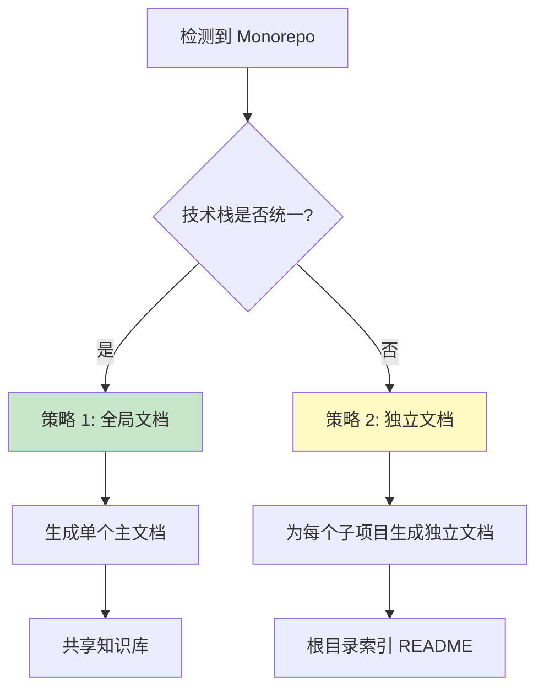

# 特殊场景处理

> **适用范围**: 所有工作流路径  
> **用途**: 处理非标准项目结构和特殊情况  
> **更新日期**: 2025-12-19

---

## 📋 场景索引

| 场景 | 触发条件 | 复杂度 | 详细说明 |
|------|---------|--------|---------|
| [场景 1: 多语言项目](#场景-1-多语言项目) | 检测到多种编程语言 | ⭐⭐ | 识别主次语言 |
| [场景 2: Monorepo 项目](#场景-2-monorepo-项目) | 检测到 workspace 配置 | ⭐⭐⭐⭐⭐ | 选择文档策略 |
| [场景 3: 未识别框架](#场景-3-未识别框架) | 无法识别项目类型 | ⭐⭐⭐ | 询问用户确认 |
| [场景 4: 文档健康度检查](#场景-4-文档健康度检查) | 检测到现有文档 | ⭐⭐⭐⭐ | 评估文档状态 |
| [场景 5: 遗留代码项目](#场景-5-遗留代码项目) | 技术栈过时 | ⭐⭐⭐ | 标注风险 |

---

## 场景 1: 多语言项目

### 触发条件

检测到项目中存在多种编程语言文件，且没有明显的主要语言。

**检测方法**:
```bash
# 使用 tokei 统计各语言代码行数
tokei --sort lines

# 或使用 cloc
cloc . --json
```

**判断标准**:
- 主要语言占比 < 60%
- 存在 ≥ 2 种语言，且占比都 > 20%

### 处理策略

#### 1. 识别主要语言和次要语言

```markdown
📊 检测到多语言项目

**语言分布**:
- TypeScript: 45% (主要语言)
- Python: 35% (次要语言)
- Shell: 15% (脚本语言)
- Other: 5%

**判断依据**:
- TypeScript 文件数最多
- 主要业务逻辑使用 TypeScript
- Python 用于数据处理和脚本
```

#### 2. 分别说明各语言的用途

在生成的文档中，应该：

1. **主文档中说明语言分布**:
   ```markdown
   ## 技术栈

   ### 主要语言
   - **TypeScript** (45%) - 前端应用和 API 层
     - 框架: Vue 3
     - 主要目录: `src/`, `api/`

   ### 次要语言
   - **Python** (35%) - 数据处理和后台任务
     - 框架: FastAPI
     - 主要目录: `scripts/`, `workers/`

   ### 脚本语言
   - **Shell** (15%) - 构建和部署脚本
     - 主要目录: `scripts/`, `deploy/`
   ```

2. **为每种语言生成对应的子文档**:
   - TypeScript 部分: `frontend_guide.md`, `api_layer.md`
   - Python 部分: `data_processing.md`, `worker_guide.md`

#### 3. 注意事项

- ✅ 不要强行选择一种语言作为"主要语言"
- ✅ 明确说明各语言的职责和边界
- ✅ 提供跨语言交互的说明（如 API 调用）
- ❌ 不要忽略次要语言的文档

---

## 场景 2: Monorepo 项目

### 触发条件

检测到以下任一特征：

**检测特征**:
1. 存在 workspace 配置文件
   - `pnpm-workspace.yaml`
   - `lerna.json`
   - `nx.json`
   - `rush.json`

2. `package.json` 中有 `workspaces` 字段

3. 存在多个子项目目录
   - `packages/`
   - `apps/`
   - `services/`

**检测命令**:
```bash
# 检测 workspace 配置文件
fd -t f "pnpm-workspace.yaml|lerna.json|nx.json|rush.json"

# 检测 packages 目录
test -d packages && echo "存在 packages 目录"

# 检测多个 package.json
fd -t f "package.json" | wc -l
```

### 处理策略

#### 策略选择流程



#### 策略 1: 全局文档（推荐）⭐⭐⭐

**适用场景**: 所有子项目使用相同或相似的技术栈

**生成结构**:
```
dev_docs/
├── AI_Coding_Context.md          # 总览文档
│   ├── Monorepo 整体架构
│   ├── 各子项目职责
│   └── 子项目间依赖关系
├── architecture_overview.md       # 整体架构
├── packages/
│   ├── package-a/
│   │   └── README.md             # 子项目简介
│   └── package-b/
│       └── README.md
└── knowledge/                     # 共享知识库
    ├── coding_standards.md
    └── deployment_guide.md
```

**输出示例**:
```markdown
✅ 检测到 Monorepo 结构（pnpm workspace）

📦 子项目清单:
- packages/web-app (Vue 3 前端)
- packages/mobile-app (React Native)
- packages/shared-utils (共享工具)

🎯 策略选择: 全局文档策略

**理由**:
- 所有子项目共享相同的开发规范
- 技术栈统一（都使用 TypeScript）
- 存在大量共享代码

**生成计划**:
1. 生成全局主文档（包含所有子项目概览）
2. 为每个子项目生成简要 README
3. 生成共享知识库（适用于所有子项目）
```

#### 策略 2: 独立文档

**适用场景**: 子项目技术栈差异大，各自独立

**生成结构**:
```
packages/
├── web-app/
│   └── dev_docs/                 # 独立文档体系
│       ├── AI_Coding_Context.md
│       ├── architecture_overview.md
│       └── ...
├── api-server/
│   └── dev_docs/                 # 独立文档体系
│       ├── AI_Coding_Context.md
│       ├── architecture_overview.md
│       └── ...
└── worker/
    └── dev_docs/                 # 独立文档体系
        ├── AI_Coding_Context.md
        └── ...

README.md                         # 根目录索引
```

**输出示例**:
```markdown
✅ 检测到 Monorepo 结构

📦 子项目技术栈差异:
- web-app: Vue 3 + TypeScript
- api-server: Node.js + Express
- worker: Python + Celery

🎯 策略选择: 独立文档策略

**理由**:
- 技术栈差异大（前端/后端/Python）
- 各子项目独立部署
- 开发团队不同

**生成计划**:
1. 为每个子项目生成独立的 dev_docs/
2. 生成根目录 README 索引文档
3. 各子项目文档互不干扰
```

#### 策略 3: 部分生成

**适用场景**: 只关注部分子项目

**用户选择**:
```markdown
检测到 Monorepo 项目结构，包含以下子项目：

1. packages/web (Vue 3)
2. packages/api (Node.js)
3. packages/shared (TypeScript 工具库)
4. packages/mobile (React Native)
5. packages/admin (Vue 3)

请选择文档生成策略：

A. 生成全局文档（推荐，适合技术栈统一）
B. 为每个子项目生成独立文档
C. 仅为特定子项目生成（部分生成）

如选择 C，请指定子项目（用逗号分隔）：
例如: web,api,shared
```

### 详细执行流程

**完整流程**: 参见 [workflows/monorepo_workflow.md](../monorepo_workflow.md)

**要点概述**:
1. 检测子项目清单（跨平台命令）
2. 用户确认生成范围（全部/部分/自定义）
3. 逐个子项目执行完整生成流程
4. 生成根目录 README 索引文档
5. 完成汇总和使用提示

---

## 场景 3: 未识别框架

### 触发条件

- 统计命令执行失败
- 无法识别项目类型
- 缺少典型的框架特征文件

### 处理策略

#### 1. 列出发现的文件类型

```markdown
⚠️ 无法自动识别项目类型

📁 发现的文件类型:
- .js 文件: 50 个
- .py 文件: 30 个
- .md 文件: 10 个
- .json 文件: 5 个

📂 主要目录结构:
```
project/
├── src/
├── lib/
├── tests/
└── docs/
```

🔍 未发现典型的框架特征文件:
- ❌ package.json
- ❌ requirements.txt
- ❌ pom.xml
- ❌ Cargo.toml
```

#### 2. 询问用户项目类型

```markdown
💡 需要您的帮助

请选择项目类型：

A. Web 前端项目（Vue/React/Angular）
B. Web 后端项目（Node.js/Python/Java）
C. 全栈项目（前端 + 后端）
D. 库/工具项目
E. 其他（请说明）

或者，您可以提供更多信息：
- 项目的主要用途是什么？
- 使用的主要技术栈是什么？
- 是否有特殊的项目结构？
```

#### 3. 记录到疑问事项

```markdown
🔵 疑问事项：项目类型未识别

**检测结果**:
- 主要语言: JavaScript
- 文件数: 95
- 目录结构: 标准（src/, lib/, tests/）

**疑问**:
- 未发现 package.json，无法确定是否为 Node.js 项目
- 未发现框架特征文件

**建议**:
- 请用户确认项目类型
- 或提供更多项目信息
```

#### 4. 注意事项

- ✅ 不要臆测项目类型
- ✅ 列出所有发现的特征
- ✅ 提供多个选项让用户选择
- ❌ 不要基于常见模式推测

---

## 场景 4: 文档健康度检查

### 触发条件

- 检测到现有 `dev_docs/` 文档体系
- 距上次文档生成已有一段时间
- 用户不确定文档是否仍然准确

### 处理策略

**详细流程**: 参见 [workflows/path_b_health_check.md](../path_b_health_check.md)

**快速概览**:

#### 三种检查模式

| 模式 | 时长 | Token 消耗 | 适用场景 |
|------|------|-----------|---------|
| 模式 1: 快速扫描 ⚡ | 1 分钟 | ~50 tokens | 快速评估 |
| 模式 2: 标准检查 ⭐ | 3-5 分钟 | ~250 tokens | 常规评估（推荐） |
| 模式 3: 深度分析 🔍 | 10-15 分钟 | ~900 tokens | 长期未更新或重大变更后 |

#### 健康度评分

**评分标准** (百分制):
- 90-100 分: ✅ 优秀 - 文档完整且最新
- 70-89 分: 🟢 良好 - 文档基本准确，有小问题
- 50-69 分: 🟡 一般 - 文档部分过时，需要更新
- 30-49 分: 🟠 较差 - 文档严重过时，建议重新生成
- 0-29 分: 🔴 极差 - 文档不可用，必须重新生成

#### 输出示例

```markdown
✅ 文档健康度检查完成（模式 1: 快速扫描）

📊 评估结果:
- 健康度评分: 75/100 🟢 良好
- 文档完整性: 8/10 个文档存在
- 文档新鲜度: 距上次更新 45 天
- 代码变更: 检测到 15 个文件变更

💡 建议操作:
A. 执行增量更新（推荐）- 更新变更的部分
B. 执行标准检查 - 深入评估文档质量
C. 重新生成文档 - 如果变更较大
D. 暂不处理 - 文档仍然可用

请选择: A / B / C / D
```

---

## 场景 5: 遗留代码项目

### 触发条件

- 代码年代久远（如使用已废弃的技术）
- 技术栈过时（如 AngularJS, Python 2）
- 缺少现代化的工具链

### 处理策略

#### 1. 在问题报告中标注技术栈过时

```markdown
🟡 警告：检测到过时的技术栈

**过时技术**:
- AngularJS 1.x（已于 2022 年停止支持）
- jQuery 2.x（建议升级到 3.x）
- Bower（已废弃，建议使用 npm）

**风险**:
- 安全漏洞风险
- 缺少社区支持
- 难以招聘维护人员

**建议**:
- 考虑技术栈升级
- 参考迁移指南（见下方链接）
```

#### 2. 建议技术升级路径

```markdown
💡 技术升级建议

### 短期方案（维持现状）
- 继续使用现有技术栈
- 加强安全补丁管理
- 文档化已知问题

### 中期方案（渐进式升级）
- AngularJS → Angular (最新版)
- jQuery → 原生 JavaScript / Vue
- Bower → npm

### 长期方案（重构）
- 评估完全重写的可行性
- 选择现代化技术栈
- 制定迁移计划

**参考资源**:
- [AngularJS 迁移指南](https://angular.io/guide/upgrade)
- [jQuery 替代方案](https://youmightnotneedjquery.com/)
```

#### 3. 继续生成文档，但标注风险

```markdown
📝 文档生成说明

**重要提示**: 本项目使用过时的技术栈，文档中会标注相关风险。

**文档中会包含**:
- ✅ 当前技术栈的使用说明
- ✅ 已知问题和限制
- ✅ 技术升级建议
- ⚠️ 安全风险提示

**不会包含**:
- ❌ 过时技术的最佳实践（可能已不适用）
- ❌ 新特性介绍（技术栈不支持）

继续生成文档...
```

#### 4. 注意事项

- ✅ 明确标注技术栈过时
- ✅ 提供升级路径建议
- ✅ 继续生成文档（不要拒绝）
- ❌ 不要推荐过时技术的"最佳实践"

---

## 🎯 场景处理原则

### 通用原则

1. **检测优先** - 基于实际检测结果，不臆测
2. **用户确认** - 不确定时询问用户
3. **记录疑问** - 所有不确定的地方都记录
4. **提供选项** - 给用户多个选择，而非单一方案
5. **继续执行** - 非致命问题不应中断流程

### 特殊场景的识别时机

| 场景 | 识别时机 | 处理时机 |
|------|---------|---------|
| 多语言项目 | Step 3（项目检测） | Step 5（确定子文档清单） |
| Monorepo 项目 | Step 1（路由决策）或 Step 3 | Step 1 或 Step 5 |
| 未识别框架 | Step 3（项目检测） | 立即询问用户 |
| 文档健康检查 | Step 1（路由决策） | 立即执行检查 |
| 遗留代码项目 | Step 3（项目检测） | Step 6（生成方案） |

---

## 📌 导航

[← 返回主文档](../../AI_ENTRY_POINT.md) | [查看其他共享资源](./README.md)
